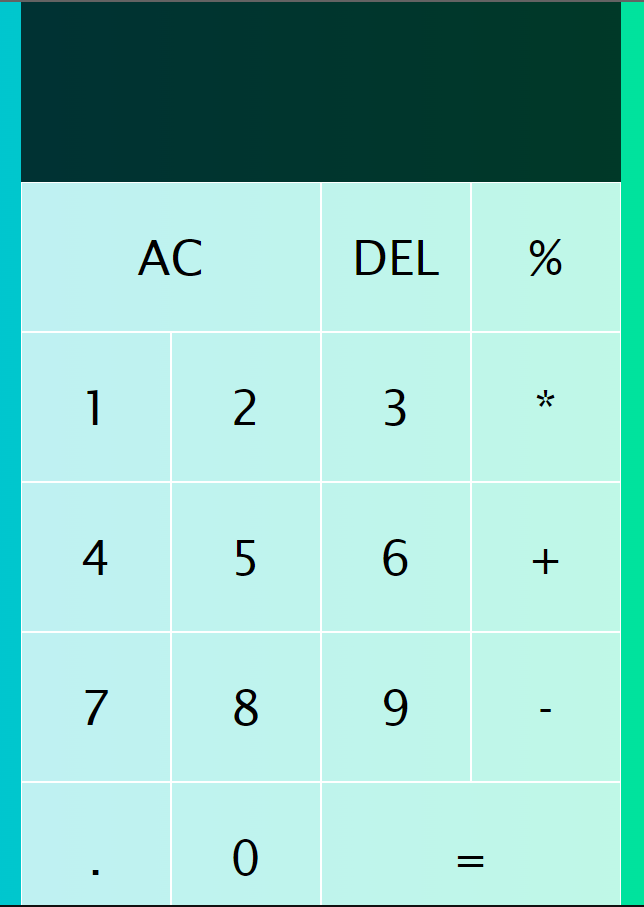
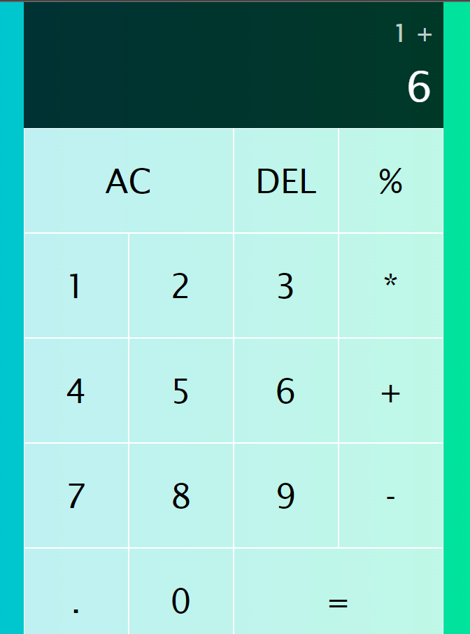
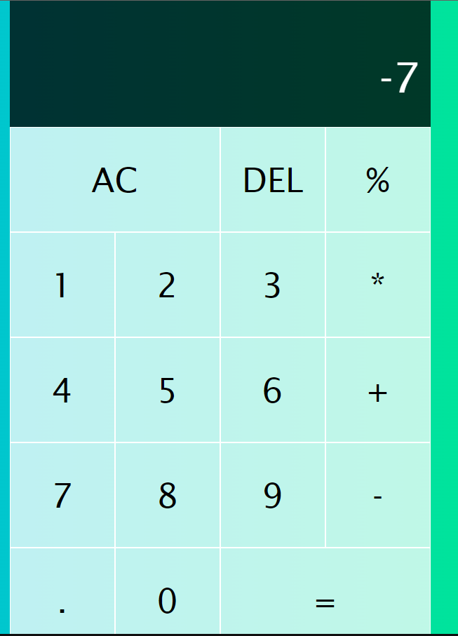
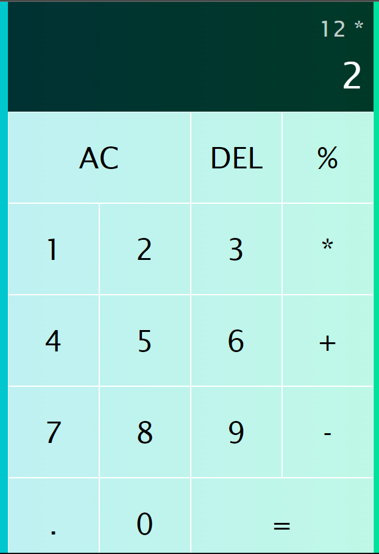
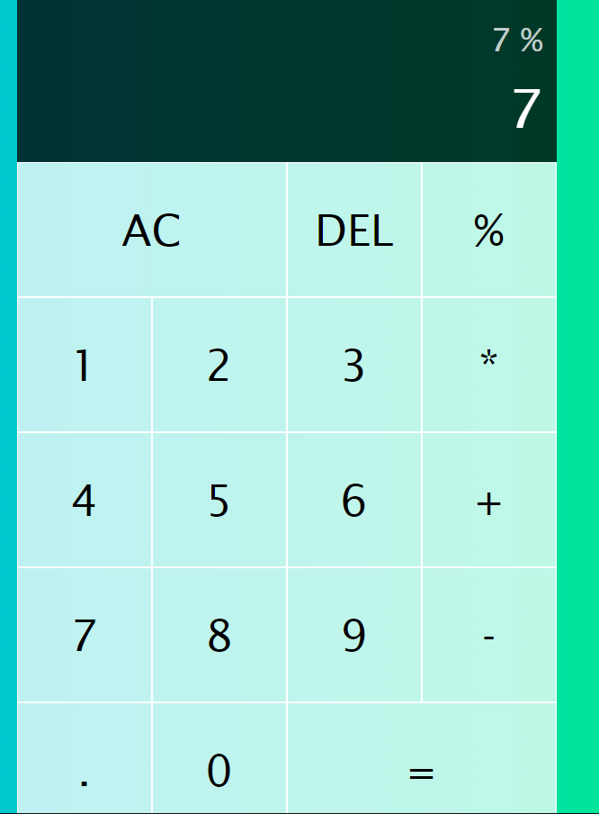

# Basic Calculator

This is a simple calculator application built using HTML, CSS, and JavaScript. The calculator supports basic arithmetic operations like addition, subtraction, multiplication, and division.

## Features

- Addition
- Subtraction
- Multiplication
- Division
- Clear functionality to reset the input

## Technologies Used

- HTML
- CSS
- JavaScript

## How to Use

1. Clone the repository:
    ```bash
    git clone https://github.com/harsHarshk133/basic-calculator-internship-project.git
    ```
2. Open the `index.html` file in your web browser:
    ```bash
    open index.html
    ```

## Screenshots

### Calculator Interface



### Addition Example



### Subtraction Example



### Multiplication Example



### Division Example



## Contributing

1. Fork the repository
2. Create a new branch (`git checkout -b feature-branch`)
3. Commit your changes (`git commit -am 'Add new feature'`)
4. Push to the branch (`git push origin feature-branch`)
5. Create a new Pull Request

## Give A Star 🌟 To Repository!

Your single star ⭐ matters alot!!!

## Acknowledgments

- Inspiration from Unified Mentor Internship & Other Online Learning Websites for reference!

---


